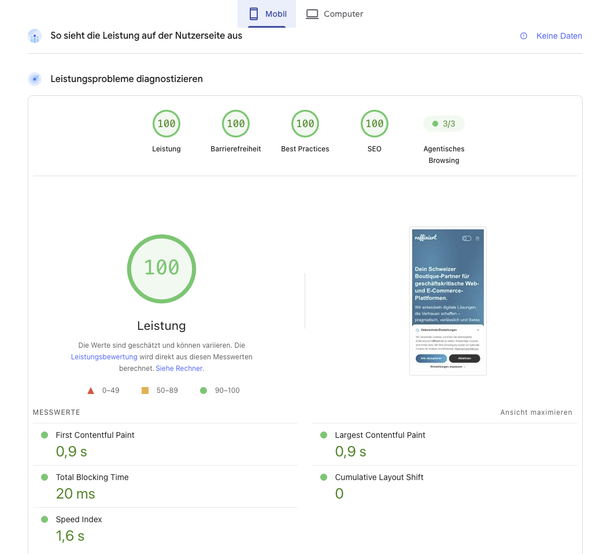

# payload-live-preview-inspector

A [Payload CMS](https://payloadcms.com) plugin that brings Storyblok-style click-to-scroll to Payload's built-in [Live Preview](https://payloadcms.com/docs/live-preview/overview): hover a component in the Live Preview iframe to highlight it, click it to smooth-scroll the admin edit form to (and briefly flash) the matching field — switching tabs, expanding collapsed accordions, and focusing the field along the way.

This plugin does **not** set up Live Preview itself. It adds the click-to-scroll behavior on top of an already-working `admin.livePreview` configuration.


## How it works

`LivePreviewInspectorClient` (in your frontend) highlights the tagged element under the pointer and, on click, posts its field path to the admin panel. `LivePreviewInspectorListener` (auto-registered by the plugin) resolves that path against the live form state and reveals the field: it switches to the right tab, expands collapsed Array/Blocks rows, scrolls, then flashes and focuses the field. Targeting is point-based and picks the smallest tagged element, so text stays clickable even beneath a full-card overlay link.

Elements get their path attribute through three layers — explicit tagging always wins, each layer only fills what the previous one didn't cover (details in [Tagging](#tagging-three-layers)):

1. **`pathOf()` (explicit)** — you tag an element yourself; exact, works for anything.
2. **Stega (automatic, opt-in)** — `inspectable(data, { stega: true })` encodes each string field's path into its value as invisible characters; the client decodes them from the rendered DOM.
3. **Value matching (automatic, zero-config)** — tags any element whose whole text equals exactly one field's current value.

From auto-tagged leaves, the client also **infers block containers**, so clicking a block's padding jumps to the whole row. Outside of an iframe, `LivePreviewInspectorClient` is a complete no-op.

## Installation

```sh
pnpm add @raffiniert-media-ag/payload-live-preview-inspector
```

Requires `react`/`react-dom` 19; `payload` and `@payloadcms/ui` are optional peers only needed on the admin side. The package has four entry points, split so nothing heavy can leak into your frontend bundles:

| Subpath     | Contains                                                               | Import it from                                  |
| ----------- | ---------------------------------------------------------------------- | ------------------------------------------------ |
| `.`         | `payloadLivePreviewInspector()` plugin                                 | `payload.config.ts`                              |
| `/client`   | `LivePreviewInspectorClient` (a `'use client'` component)              | only the file that mounts the component          |
| `/path`     | `inspectable`, `pathOf`, `stegaClean`, constants — pure, no components | everywhere else: pages, blocks, Server Components |
| `/listener` | admin-side listener (imports `@payloadcms/ui`)                         | nowhere — the plugin wires it up for you         |

Bundlers treat `'use client'` barrels as indivisible: importing helpers from `/client` inside any client component drags the whole inspector into every visitor's bundle. Import them from `/path` instead.

## Setup

### 1. Admin (Payload config)

List the collections/globals that should get click-to-scroll (each must already have Live Preview enabled):

```ts
import { payloadLivePreviewInspector } from '@raffiniert-media-ag/payload-live-preview-inspector'

export default buildConfig({
  admin: {
    livePreview: {
      collections: ['posts'],
      url: ({ data }) => `https://your-frontend.example.com/preview/posts/${data.id}`,
    },
  },
  plugins: [
    payloadLivePreviewInspector({
      collections: { posts: true },
      globals: { siteSettings: true },
    }),
  ],
})
```

Optional overrides (defaults shown): `flashColor: '#3fb950'`, `flashDurationMs: 1200`, `scrollOffset: 100`, `accordionAnimationMs: 350`, `tabSwitchWaitMs: 1500` (max wait for freshly mounting fields — per candidate tab during a tab search, and after scrolling toward a field that hasn't rendered yet; raise it if very heavy tabs get skipped).

### 2. Frontend

Mount `LivePreviewInspectorClient` once, near the root of whatever page renders inside the Live Preview iframe:

```tsx
import { LivePreviewInspectorClient } from '@raffiniert-media-ag/payload-live-preview-inspector/client'

export default function PreviewPage() {
  return (
    <>
      <LivePreviewInspectorClient />
      {/* ...your page... */}
    </>
  )
}
```

Then tag elements. The recommended way is `inspectable()` + `pathOf()`: wrap your document data once, and every nested node knows its own field path — array/blocks rows are addressed by their stable `id`, so the mapping survives reordering. Plain JavaScript, no hooks — works in Server Components too:

```tsx
import { inspectable, pathOf } from '@raffiniert-media-ag/payload-live-preview-inspector/path'

const page = inspectable(data)

<h1 {...pathOf(page, 'title')}>{page.title}</h1>

{page.layout?.map((block) => (
  <section key={block.id} {...pathOf(block)}>
    <h2 {...pathOf(block, 'heading')}>{block.heading}</h2>
  </section>
))}
```

`pathOf(node)` addresses the node itself (e.g. a whole block); `pathOf(node, 'fieldName')` a field on it. You don't have to tag everything by hand — the two automatic layers below fill most gaps.

## Tagging: three layers

Explicit `pathOf()` attributes are never overwritten by the automatic layers; auto-tagged elements carry `data-payload-live-preview-auto="stega" | "match" | "container"` so you can tell them apart in devtools.

### 1. `pathOf()` — explicit, most precise

Works for anything (images, numbers, whole blocks, elements without text) and relies on no heuristic. Use it wherever the automatic layers don't reach.

### 2. Stega — automatic tagging for text content

Pass `stega: true` to `inspectable()` and every prose string read from the proxy carries its field path as invisible characters — wherever it ends up in the DOM, however many component or server/client boundaries it crossed, the scanner tags the containing element. `alt`, `title`, `aria-label`, and `placeholder` attributes are scanned too.

**The two-word safety rule:** only strings with **at least two whitespace-separated words** are encoded. Single tokens (`'default'`, `'topRight'`) are what code uses as object keys and comparison targets — encoding one would silently break lookups like `styles[block.variant]`. Select/radio/enum values practically never contain whitespace, so they're safe by construction. The flip side: single-word display text isn't stega-tagged (value matching or `pathOf()` covers it). Also skipped: `id`/`blockType`/`blockName`/`slug`, URL-/date-/number-/uuid-shaped values, and strings inside arrays. Exception: `alt`, `ariaLabel`, `placeholder` are always encoded — they only land in attributes value matching can't reach, and code never compares them.

Fine-tuning and raw values when you need them:

```ts
const page = inspectable(data, {
  stega: {
    encodeKeys: ['buttonLabel'],  // always encode - fields you KNOW are display text
    skipKeys: ['cssClasses'],     // never encode
    filter: ({ defaultEncode, key, path, value }) => defaultEncode, // final say per string
  },
})

import { stegaClean } from '@raffiniert-media-ag/payload-live-preview-inspector/path'
stegaClean(page.title) // raw string - use before ===, new Date(), APIs; also deep-cleans objects
```

Trade-off: encoded strings contain extra characters — `===` against literals fails and `slice()` can destroy a tag (it's then simply lost, never wrong). All of it exists only in preview mode (see [Production](#production--performance)).

### 3. Value matching — zero-config

On by default — the client asks the admin panel for the document's current string values and tags any element whose entire text equals exactly one field's value. Rich-text fields contribute their individual text runs, mapped back to their editor. Deliberately conservative: values shared by several fields (e.g. a hero title duplicated into the SEO title) are never matched, values under 3 characters are ignored, and only whole-element matches count. In development, the preview console logs each skipped ambiguous value with the colliding field paths. Set `valueMatching={false}` to turn it off.

### Container inference

Elements whose paths share an Array/Blocks row prefix vote for their closest common ancestor as that row's container. Skipped when the row is already tagged, and never applied to ancestors containing another row's elements. `pathOf(block)` remains more reliable for blocks that render little text.

## Link interception

By default the client prevents every `<a href>` inside the iframe from navigating — including client-side router links (Next.js `<Link>` etc.), which are intercepted in the capture phase before their own handler runs. Pass `disableLinks={false}` to restore navigation. Middle-clicks and Cmd/Ctrl-clicks bypass it.

## Server/client component boundaries

The proxy's path metadata doesn't survive serialization — passing a wrapped node from a Server Component into a Client Component makes `pathOf()` come up empty on the other side. In order of preference:

1. **Stega** — the path travels inside the string value itself, surviving any boundary.
2. **`serializable: true`** — embeds each node's path as a `__payloadLivePreviewPath` property that survives JSON (visible in `Object.keys()`; array nodes can't carry it, their object children do).
3. **Pass `pathOf()` results as props** — they're plain serializable objects.

## Production / performance

Nothing here reaches real visitors: outside an iframe the client attaches no listeners and scans nothing (its only cost is a few kB of bundle), the proxy overhead is negligible, and path attributes/stega characters exist only while enabled. A production site running this plugin scores **100/100 mobile Performance** in Lighthouse:



The cleanest setup is a dedicated preview route (like this repo's `dev/app/(frontend)/preview/...`) — the public route never imports any of this. If you share components between public and preview rendering, `enabled` is the single kill switch for all output layers:

```tsx
import { draftMode } from 'next/headers'

const { isEnabled } = await draftMode()
const page = inspectable(data, { enabled: isEnabled, stega: true })
// enabled: false → no path attributes, no stega characters, no markers.
```

## API reference

From `.` (Payload config):

- `payloadLivePreviewInspector({ collections?, globals?, disabled?, flashColor?, flashDurationMs?, scrollOffset?, accordionAnimationMs?, tabSwitchWaitMs? })` — see [Setup](#1-admin-payload-config).

From `/path` (pure helpers, safe anywhere; also re-exported from `/client`):

- `inspectable(data, options?)` — path-tracking proxy. Options: `enabled`, `stega: true | { encodeKeys?, skipKeys?, filter? }`, `serializable`.
- `pathOf(node, subPath?)` — the path attribute for a wrapped node.
- `stegaClean(value)` — strips stega characters from a string or a whole object tree.
- `LIVE_PREVIEW_PATH_ATTRIBUTE`, `LIVE_PREVIEW_AUTO_ATTRIBUTE`, `SERIALIZED_PATH_KEY`, `LIVE_PREVIEW_HOVER_CLASS_NAME` — the raw attribute/class names, e.g. to tag or restyle manually.

From `/client` (import only where you mount it):

- `LivePreviewInspectorClient({ disableLinks?, hoverColor?, stega?, targetOrigin?, valueMatching? })` — all optional. `targetOrigin` pins the `postMessage` target to your admin origin; when omitted it's auto-detected (falls back to `'*'` — the payload is just a field-path string).

From `/listener`: `LivePreviewInspectorListener` — admin-side; the plugin registers it for you.

## Known limitations

- Fields that only render inside a relationship's edit drawer aren't reachable — the click silently no-ops. Same for a row deleted after the preview was rendered.
- Finding a field in another tab clicks through the form's tabs (originals restored when nothing is found). Fields that mount slower than `tabSwitchWaitMs` after a tab switch or scroll can make the reveal settle on the nearest parent — raise the option for very heavy forms.
- Multi-locale setups or drawer-duplicated fields can get suffixed DOM ids; the `field-<path>` lookup may occasionally miss there.
- Stega only reaches values rendered as text (or `alt`/`title`/`aria-label`/`placeholder`) with two or more words; string operations that reshape a value (`slice()`, regexes) destroy the tag — the element is then untagged, never mistagged. Copied preview text carries the invisible characters (preview-only).
- Value matching needs exact whole-element equality with exactly one field's value — formatted dates, truncated teasers, and duplicated values don't match, by design.
- Container inference backs off on interleaved markup and blocks that render no taggable leaf; use `pathOf(block)` there.

## Local development

The `dev/` folder is a full Payload app (SQLite, nothing external) for developing the plugin:

```sh
pnpm install
pnpm dev        # http://localhost:3000/admin - dev@payloadcms.com / test
pnpm test:int   # vitest unit tests
pnpm test:e2e   # playwright - full hover/click/scroll/flash flow
```
